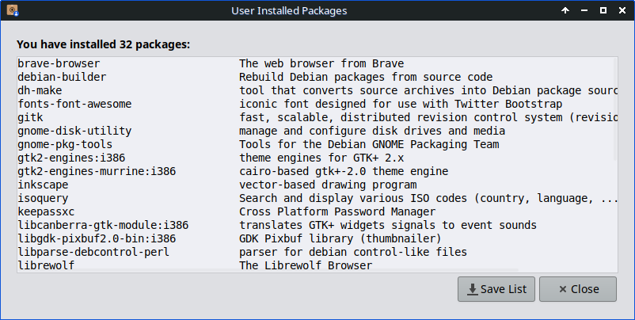
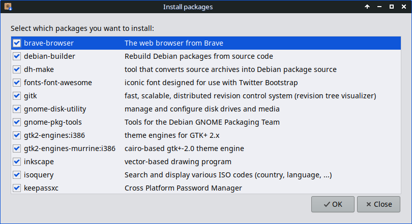

##User Installed Packages Help

This application is intended to facilitate the reinstallation of 
packages that the user has added to the default installation.

It can display a list of packages manually installed by the user. This 
list can be saved in a simple text file.

Furthermore, the application allows to load a saved list of packages. 
The loaded package list is displayed for selection. The user can now 
select which packages to install.

Especially after a new installation of the system, it is easy to select 
the desired packages for installation from an existing list of 
user-installed packages.

**There are two options to choose from:**

1. **quickly and easily create a list of those packages**
2. **use that list in another location to review and reinstall those packages, if still available**

###Create a list of user installed packages

* A list of user installed packages is displayed.
* Note: Packages of installed Linux kernels or NVIDIA graphics driver will not be listed.

* Press [Save List] and select the location to save the package list.
  
###Open a previously saved list to install selected packages

* Select the package list you wish to install.
* The package list will be displayed.
* Uncheck any packages in the list you do not wish to install. 
* A notification is provided for any missing packages.

* Press [OK] and the selected packages will be installed if still available.

###Unavailable packages will be listed

* Packages unavaible or cannot be installed will be listed.
* Press [Save List] and select location to save the list of missing packages.

###Packages available with be installed

* The installation process is started within a new terminal window.
* Authentication to perform installtion is required.
* Confirmation to perform the installtion is requested. Press [N] to cancel installtion.

* To close the terminal window after the installtion process finshed press [Enter].
   
Version: @VERSION@
Last updated: @DATE@

